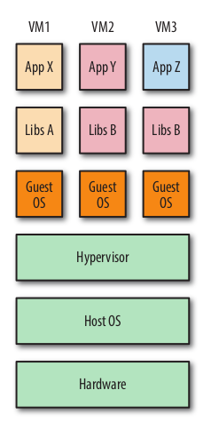
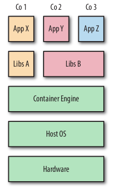

# Using Docker

<!--toc:start-->

- [Using Docker](#using-docker)
    - [Что такое контейнеры и для чего они нужны](#что-такое-контейнеры-и-для-чего-они-нужны)

<!--toc:end-->

## Что такое контейнеры и для чего они нужны

Контейнеры (containers) представляют собой средства инкапсуляции приложения вместе с его зависимостями.
На первый взгляд контейнеры могут показаться всего лишь упрощенной формой виртуальных машин
(virtual machines – VM) – как и виртуальная машина, контейнер содержит изолированный экземпляр операционной
системы (ОС), который можно использовать для запуска приложений.

Но контейнеры обладают некоторыми преимуществами, обеспечивающими такие варианты использования, которые трудно или
невозможно реализовать в обычных виртуальных машинах:

- контейнеры совместно используют ресурсы основной ОС, что делает их на
  порядок более эффективными. Контейнеры можно запускать и останавливать за доли секунды.
  Для приложений, запускаемых в контейнерах, накладные расходы минимальны или вообще отсутствуют,
  по сравнению с приложениями, запускаемыми непосредственно под управлением основной ОС;
- переносимость контейнеров обеспечивает потенциальную возможность устранения целого класса программных
  ошибок, вызываемых незначительными изменениями рабочей среды, – лишается обоснования древний довод
  разработчика: «но это работает на моем компьютере»;
- упрощенная сущность контейнера означает, что разработчики могут одновременно запускать десятки контейнеров,
  что дает возможность имитации работы промышленной распределенной системы. Инженеры по эксплуатации могут
  запустить на одном хосте намного больше контейнеров, чем при использовании отдельных виртуальных машин;
- кроме того, контейнеры предоставляют преимущества конечным пользователям и разработчикам без
  необходимости развертывания приложения в облаке. Пользователи могут загружать и запускать сложные приложения
  без многочасовой возни с конфигурированием и проблемами при установке и при этом не беспокоиться о каких-либо
  изменениях в их локальных системах. В свою очередь, разработчики подобных приложений могут избежать
  проблем, связанных с различиями в конфигурациях пользовательских сред и с доступностью зависимостей для этих
  приложений.

И что более важно, существуют принципиальные различия в целях использования виртуальных машин и
контейнеров – целью применения виртуальной машины является полная эмуляция инородной программной
(операционной) среды, тогда как цель применения контейнера – сделать приложения переносимыми и самодостаточными.

|  |  | 
|:---------------------------------------------------------------------:|:-------------------------------------------------------------:| 
|          *Три виртуальные машины, работающие на одном хосте*          |          *Три контейнера,работающих на одном хосте*           |

## Образы, контейнеры и файловая система Union File System

Чтобы понять взаимосвязь между образами и контейнерами, необходимо более подробно рассмотреть ключевой
элемент технологии, лежащей в основе Docker, – UFS (иногда используется термин «каскадно-объединенное монтирование»
(union mount)). Файловые системы с каскадно-объединенным монтированием позволяют подключать несколько
файловых систем с перекрытием (или наложением друг на друга), причем для пользователя они будут выглядеть как
одна файловая система. Каталоги могут содержать файлы из нескольких файловых систем, но если двум
файлам в точности соответствует один и тот же путь, то файл, смонтированный
самым последним, скроет все ранее монтированные файлы. Docker поддерживает
несколько различных реализаций UnionFS, включая AUFS, Overlay, devicemapper,
BTRFS и ZFS. Реализацию, используемую в конкретной системе, можно определить командой docker info – смотреть
содержимое заголовка «Storage Driver». Файловую систему можно заменить, но это рекомендуется только в
тех случаях, когда вы точно знаете, что делаете, и хорошо знакомы со всеми преимуществами и недостатками
используемых файловых систем.
Образы Docker состоят из нескольких уровней (layers). Каждый уровень представляет собой защищенную от
записи файловую систему. Для каждой инструкции в Dockerfile создается свой уровень, который
размещается поверх предыдущих уровней. Во время преобразования образа в контейнер (командой docker run
или docker create) механизм Docker выбирает нужный образ и добавляет на самом
верхнем уровне файловую систему с возможностью записи (одновременно с этим
инициализируются разнообразные параметры настройки, такие как IP-адрес, имя,
идентификатор и ограничения ресурсов).
Поскольку ненужные уровни значительно увеличивают размеры образов (а для
файловой системы AUFS установлен строгий лимит, равный 127 уровням), во многих файлах Dockerfile можно
обнаружить попытку свести к минимуму количество
уровней посредством записи нескольких команд Unix в одной инструкции RUN.
Контейнер может находиться в одном из следующих состояний: «создан» (created),
«перезапуск» (restarting), «активен» или «работает» (running), «приостановлен»
(paused) или «остановлен» (exited). «Созданным» считается контейнер, который
был инициализирован командой docker create, но его работа пока еще не началась. Состояние exited в
общем случае соответствует состоянию «остановлен»
(stopped), когда в данном контейнере нет активно выполняющихся процессов (их
нет и в «созданном» контейнере, но остановленный контейнер уже запускался, по
крайней мере один раз). Контейнер существует, пока существует его основной
процесс. Остановленный контейнер можно перезапустить командой docker start.
Остановленный контейнер – это не то же самое, что исходный образ. Остановленный контейнер сохраняет все
изменения в его параметрах настройки, метаданных
и файловой системе, в том числе и параметры конфигурации времени выполнения, например IP-адрес, которые
не хранятся в образах. Состояние перезапуска
на практике встречается редко и возникает в тех случаях, когда механизм Docker
пытается повторно запустить контейнер после неудачной первой попытки.

